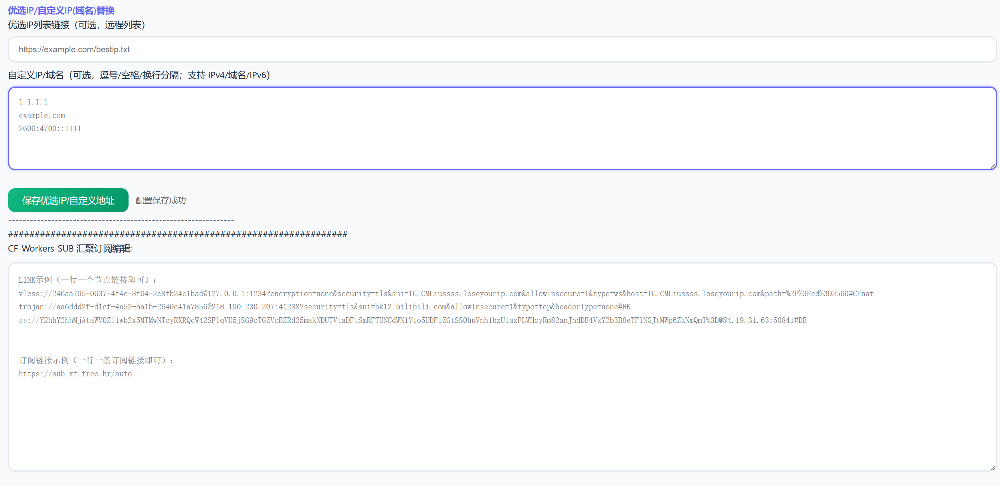

# CF-Workers-SUB-Modified

基于 [cmliu/CF-Workers-SUB](https://github.com/cmliu/CF-Workers-SUB) 修改的 Cloudflare Workers 订阅聚合与转换工具。



## ⚙ 功能特点

- **订阅聚合** - 将多个订阅源合并为一个订阅链接
- **格式转换** - 支持 Base64、Clash、Sing-box、Surge、Quantumult X、Loon 等多种格式
- **多订阅管理** - 支持创建多个独立的子订阅（sub1, sub2...）
- **优选 IP** - 支持自定义优选 IP/域名替换节点地址
- **本地优选上传** - 支持从本地电脑上传优选 IP 文件到 Worker（新功能）
- **KV 存储** - 使用 Cloudflare KV 存储配置数据
- **现代化 UI** - 响应式设计，支持明暗主题

---

## 🛠️ 部署方法

### 1. 部署 Cloudflare Worker

- 在 [Cloudflare Dashboard](https://dash.cloudflare.com/) → Workers & Pages 中创建一个新的 Worker
- 将 [worker.js](worker.js) 的内容粘贴到 Worker 编辑器中并保存

### 2. 设置环境变量

在 Worker 设置 → 变量 中添加：

| 变量名 | 示例 | 必填 | 备注 |
|--------|------|:----:|------|
| `TOKEN` | `your-secret-token` | ✅ | 管理员访问令牌，建议使用复杂字符串 |
| `SUBAPI` | `sub.xeton.dev` | ❌ | 订阅转换后端地址（不带 https://） |
| `SUBCONFIG` | `https://raw.github...` | ❌ | 订阅转换规则配置文件 URL |

> 💡 如果不设置 `SUBAPI`，默认使用内置的订阅转换后端。

### 3. 绑定 KV 命名空间（强烈推荐）

> ⚠️ **重要**: 强烈建议绑定 KV！不绑定的话每次修改订阅都需要改代码重新部署。

| 功能 | 无 KV | 有 KV |
|------|:-----:|:-----:|
| 在线编辑订阅 | ❌ 需改代码 | ✅ 网页直接编辑 |
| 多订阅管理 | ❌ 不支持 | ✅ 支持 sub1/sub2/... |
| 本地优选上传 | ❌ 不支持 | ✅ 脚本一键上传 |
| 配置持久化 | ❌ | ✅ KV 永久存储 |

**绑定步骤：**
1. Cloudflare Dashboard → 存储与数据库 → workers KV → 创建命名空间
2. 进入你的 Worker → 绑定 → 添加绑定 → KV 命名空间绑定
3. 添加绑定，**变量名必须为 `KV`**
4. 保存即可

### 4. 开始使用

- **管理面板**: `https://your-worker.workers.dev/{TOKEN}`
- **编辑订阅**: `https://your-worker.workers.dev/sub1/{TOKEN}/edit`（sub1/sub2/sub3...）
- **获取订阅**: `https://your-worker.workers.dev/sub1?token={TOKEN}`

---

## 📤 本地优选 IP 上传功能

这是本版本新增的核心功能，让你可以方便地将本地电脑优选好的 IP 上传到 Worker。

### 使用场景

你在本地运行了优选 IP 工具（如 CloudflareST），得到了一个 `result.csv` 或 `ip.txt` 文件，想把这些 IP 用在订阅里。

### 使用步骤

1. **进入订阅编辑页面**

   访问 `https://your-worker.workers.dev/sub1/{TOKEN}/edit`

2. **选择优选 IP 模式**

   在"优选IP链接"区域，你会看到两个选项：

   - **远程链接** - 填入一个在线的 IP 列表链接（传统方式）
   - **本地文件** - 从本地电脑上传 IP 文件（新功能）

3. **如果选择"本地文件"模式**

   1. 填入文件名（如 `result.csv`），用于标识存储在 KV 中的数据
   2. 点击"下载 Windows 脚本"或"下载 Linux 脚本"
   3. 将下载的脚本保存到你的电脑上result.csv的目录下
   4. 双击运行脚本，它会自动读取你的 IP 文件（result.csv）并上传到 Worker
   5. 点击"保存配置"完成设置
   6. 每次运行脚本后，刷新一下代理软件上的订阅就能够获得优选ip节点啦

4. **之后每次更新优选 IP**

   只需重新运行脚本即可，无需进入网页操作

### 工作原理

```
┌─────────────────┐    脚本上传     ┌──────────────────┐
│  本地 IP 文件   │  ──────────►   │  Cloudflare KV   │
│  result.csv     │                │  存储 IP 数据    │
└─────────────────┘                └──────────────────┘
                                            │
                                            ▼
                                   ┌──────────────────┐
                                   │  Worker 读取 KV  │
                                   │  替换节点 IP     │
                                   └──────────────────┘
```

### 注意事项

- Windows 运行 .bat 脚本时可能提示"没有数字签名"，点击"仍要运行"即可
- 脚本是专属于当前订阅的，每个 sub 有独立的脚本
- 需要绑定 KV 才能使用本地上传功能

---

## 🔧 主要修改

相比原项目，本版本进行了以下修改：

- 新增本地优选 IP 上传功能（TEXT2KV 整合）
- 支持 `kv://` 协议读取 KV 中的优选 IP 数据
- 移除了部分硬编码的外部资源引用
- 优化了部分代码结构

---

## 📜 许可证

本项目采用 [Apache-2.0](LICENSE) 许可证开源。

## 🙏 致谢

- [cmliu/CF-Workers-SUB](https://github.com/cmliu/CF-Workers-SUB) - 原项目
- [Alice Networks LTD](https://url.cn/FQhHP2tg) - 提供订阅转换后端支持
- [mianayang](https://github.com/mianayang) - 订阅转换后端
- [ACL4SSR](https://github.com/ACL4SSR/ACL4SSR) - 订阅转换规则配置
- [肥羊](https://github.com/youshandefeiyang) - 订阅转换后端
